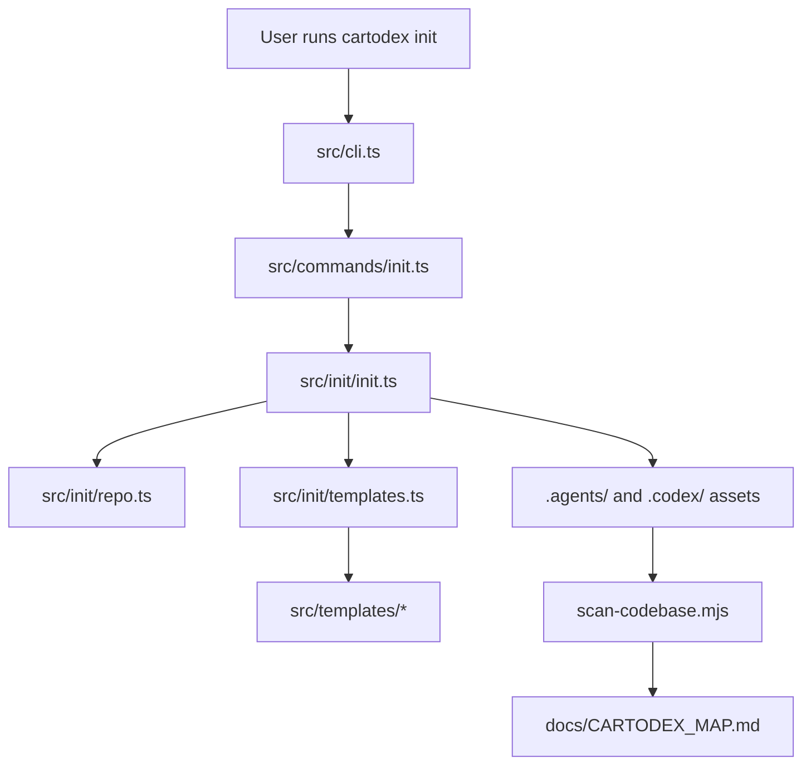

# Cartodex Map

> Auto-generated by Cartodex, a Codex port inspired by Cartographer. Last mapped: 2026-06-21T20:19:05Z

## System Overview

Cartodex is a TypeScript/npm CLI package that installs repository-local Codex assets for codebase mapping. Its public surface is the `cartodex init` command, which copies managed skill, scout-agent, scanner, and AGENTS templates into a target Git repository. The installed skill then runs the bundled scanner, delegates focused analysis, and writes or updates this map.

The package is intentionally template-driven: source files under `src/` define the CLI and scanner behavior, while files under `src/templates/` are the installable assets. `npm run build` regenerates the bundled scanner template with esbuild before compiling TypeScript into `dist/`.



## Directory Structure

```text
.
├── src/
│   ├── cli.ts                         CLI executable entry point
│   ├── commands/init.ts               Commander registration for `cartodex init`
│   ├── init/                          Git-root discovery and template installation
│   ├── scanner/                       Repository scanner and token estimator
│   └── templates/                     Assets installed into target repositories
├── tests/
│   ├── init.test.ts                   Init workflow and AGENTS merge tests
│   └── scanner/scan-codebase.test.ts  Scanner filtering, output, and CLI parsing tests
├── .agents/skills/cartodex/           Installed local Cartodex skill used by this repo
├── .codex/agents/cartodex-scout.toml  Installed read-only scout profile
├── docs/CARTODEX_MAP.md               Generated architecture/navigation map
├── package.json                       npm metadata, bin, scripts, dependencies
├── README.md                          User-facing install and usage guide
├── NOTICE.md                          Upstream attribution notice
└── AGENTS.md                          Repository guidelines plus Cartodex map pointer
```

The scanner skipped `src/templates/skill/scripts/scan-codebase.mjs` because it is a large generated bundle. Edit `src/scanner/scan-codebase.ts` and run `npm run build:scanner` instead of editing that file by hand.

## Module Guide

### CLI

**Purpose**: Exposes the `cartodex` executable and registers the `init` command.
**Entry point**: `src/cli.ts`
**Key files**:

| File | Purpose | Tokens |
| --- | --- | ---: |
| `src/cli.ts` | Creates the Commander program, sets CLI metadata, registers commands, and parses argv. | 78 |
| `src/commands/init.ts` | Defines `cartodex init`, `--force`, and `--check`; prints result messages and sets `process.exitCode`. | 224 |

**Exports**: `registerInitCommand(program: Command): Command`.
**Dependencies**: `commander`, `initCartodex`.
**Dependents**: package binary `cartodex` points at compiled `dist/cli.js`.

### Init Installer

**Purpose**: Finds the target Git repository and installs or validates Cartodex-managed files.
**Entry point**: `initCartodex(options: InitOptions)` in `src/init/init.ts`.
**Key files**:

| File | Purpose | Tokens |
| --- | --- | ---: |
| `src/init/init.ts` | Core state machine for missing/current/stale/conflict files, write policy, AGENTS merge, messages, and exit code. | 1551 |
| `src/init/repo.ts` | Walks upward to find a `.git` directory or worktree pointer file. | 202 |
| `src/init/templates.ts` | Reads source templates, injects managed markers, and declares install target paths and script mode. | 870 |
| `tests/init.test.ts` | Covers git-root detection, idempotency, `--check`, `--force`, stale files, conflicts, and AGENTS block replacement. | 1673 |

**Exports**: `initCartodex`, `upsertAgentsSection`, `findGitRoot`, template constants, and init result types.
**Dependencies**: Node fs/path APIs and source templates under `src/templates/`.
**Dependents**: `src/commands/init.ts`, tests, and the published CLI workflow.

The init state machine is:

| Status | Meaning | Normal operation | With `--force` | With `--check` |
| --- | --- | --- | --- | --- |
| `missing` | Target is absent or AGENTS block is absent. | Created | Created | Checked only, exit 1 |
| `current` | Target exactly matches desired content. | Unchanged | Unchanged | Checked only, exit 0 if all current |
| `stale` | Target has Cartodex managed marker but differs from template. | Blocked | Updated | Checked only, exit 1 |
| `conflict` | Target exists without a managed marker, or AGENTS markers are malformed. | Blocked | Blocked | Checked only, exit 1 |

### Scanner

**Purpose**: Produces a deterministic, token-budgeted inventory of repository text files for Cartodex planning.
**Entry point**: `runCli()` and `scanDirectory()` in `src/scanner/scan-codebase.ts`.
**Key files**:

| File | Purpose | Tokens |
| --- | --- | ---: |
| `src/scanner/scan-codebase.ts` | Recursive scanner, output formatters, CLI parsing, path validation, and entrypoint detection. | 3086 |
| `src/scanner/ignore.ts` | Default ignore rules, installed-scanner exclusion, `.gitignore` parsing, and minimatch matching. | 906 |
| `src/scanner/tokens.ts` | `js-tiktoken` adapter with fallback token estimate. | 94 |
| `tests/scanner/scan-codebase.test.ts` | Tests text detection, ignores, skip reasons, output ordering, tree formatting, and argument parsing. | 1289 |

**Exports**: `scanDirectory`, `formatTree`, `parseArgs`, `runCli`, `isTextFile`, `shouldIgnore`, `parseGitignore`, `matchesGitignorePattern`, `loadEncoding`, `countTokens`, and scanner result types.
**Dependencies**: `js-tiktoken`, `minimatch`, Node fs/path/url APIs.
**Dependents**: bundled scanner template at `src/templates/skill/scripts/scan-codebase.mjs`, installed scanner path `.agents/skills/cartodex/scripts/scan-codebase.mjs`, and tests.

Scanner CLI contract:

```bash
scan-codebase.mjs [path] [--format json|tree|compact] [--max-tokens N] [--encoding NAME]
```

The default format is `json`, default encoding is `cl100k_base`, and default per-file token cap is `50_000`. Parse errors return exit code `2`; missing or non-directory paths and tokenizer load failures return exit code `1`. JSON output includes `root`, `files`, `directories`, `total_tokens`, `total_files`, and `skipped`.

Skip reasons are `permission_denied`, `too_large`, `binary`, `too_many_tokens`, and `read_error: ...`. The scanner also ignores dependency/build outputs, common binary/archive/media names, lockfiles, repository `.gitignore` patterns, and the installed Cartodex scanner script path.

### Templates and Installed Assets

**Purpose**: Defines the assets that `cartodex init` installs into target repositories.
**Entry point**: `INIT_TEMPLATES` in `src/init/templates.ts`.
**Key files**:

| File | Purpose | Tokens |
| --- | --- | ---: |
| `src/templates/skill/SKILL.md` | Source Cartodex skill workflow installed into `.agents/skills/cartodex/SKILL.md`. | 1315 |
| `src/templates/skill/resources/cartodex-map-structure.md` | Canonical structure for generated maps. | 324 |
| `src/templates/skill/resources/subagent-report-format.md` | Required format for Cartodex scout/subagent reports. | 267 |
| `src/templates/skill/scripts/scan-codebase.mjs` | Generated executable scanner bundle; regenerated by `npm run build:scanner`. | skipped |
| `src/templates/codex/cartodex-scout.toml` | Read-only scout agent template installed into `.codex/agents/`. | 375 |
| `src/templates/AGENTS.cartodex.md` | Managed AGENTS block pointing future agents to `docs/CARTODEX_MAP.md`. | 101 |
| `.agents/skills/cartodex/*` | Installed runtime copy of the Cartodex skill, resources, and scanner script. | 1975 |
| `.codex/agents/cartodex-scout.toml` | Installed runtime scout profile for this repository. | 397 |

**Exports**: Template constants and `INIT_TEMPLATES`.
**Dependencies**: Source template files on disk; marker injection helpers in `src/init/templates.ts`.
**Dependents**: `initCartodex`, README install docs, and repo-local Cartodex usage.

Managed marker handling differs slightly by file type: Markdown resources receive an HTML comment marker, scout TOML receives a TOML comment marker, skill frontmatter is preserved at the top of `SKILL.md`, and the generated scanner script keeps its shebang before receiving a JavaScript marker comment. The scanner template target is installed with mode `0o755`.

### Packaging and Project Metadata

**Purpose**: Publishes Cartodex as an npm CLI package and defines build/test workflows.
**Entry point**: `package.json`.
**Key files**:

| File | Purpose | Tokens |
| --- | --- | ---: |
| `package.json` | Package name/version, `bin`, files list, scripts, dependencies, Node engine, npm package manager. | 465 |
| `tsconfig.json` | NodeNext TypeScript config compiling `src` to `dist`. | 124 |
| `README.md` | Installation, init behavior, scanner overview, update-mode overview, scout agent, attribution, license. | 609 |
| `NOTICE.md` | Upstream attribution notice. | 69 |
| `LICENSE` | MIT license. | 233 |

**Exports**: Published binary `cartodex` at `dist/cli.js`; no explicit package `exports` map.
**Dependencies**: runtime dependencies `commander`, `js-tiktoken`, and `minimatch`; dev dependencies `esbuild`, `typescript`, `vitest`, and `@types/node`.
**Dependents**: npm users running `npx cartodex init`.

Build scripts:

| Command | Behavior |
| --- | --- |
| `npm run build:scanner` | Bundles `src/scanner/scan-codebase.ts` into `src/templates/skill/scripts/scan-codebase.mjs` with esbuild. |
| `npm run build` | Runs `build:scanner`, then `tsc -p tsconfig.json`. |
| `npm test` | Runs Vitest once. |
| `npm pack --dry-run` | Previews the published npm package contents after build. |

## Data Flow

The install flow starts in the CLI and ends with repository-local assets:

1. `cartodex init` calls `registerInitCommand`, which calls `initCartodex`.
2. `initCartodex` finds the Git root, analyzes each template target, and classifies it as `missing`, `current`, `stale`, or `conflict`.
3. Unless `--check` is set, the installer writes missing files and writes stale managed files only when `--force` is set.
4. `AGENTS.md` is handled specially by replacing only the Cartodex marker block or appending it when absent.
5. The command prints per-file statuses and returns a non-zero exit code for check failures, stale unmanaged blockers, or conflicts.

The mapping flow starts after assets are installed:

1. A fresh Codex thread loads `.agents/skills/cartodex/SKILL.md` and `.codex/agents/cartodex-scout.toml`.
2. The skill runs `node .agents/skills/cartodex/scripts/scan-codebase.mjs . --format json`.
3. The scanner emits file, directory, token, and skipped-file data.
4. The main agent assigns bounded read-only analysis tasks, synthesizes reports using the installed resource templates, writes `docs/CARTODEX_MAP.md`, and refreshes the Cartodex block in `AGENTS.md`.

The scanner traversal is deterministic: directories are visited before files, names are sorted case-insensitively, output paths are normalized with `/`, and token totals are accumulated from files that pass ignore, size, binary, UTF-8, and max-token checks.

## Conventions

Use TypeScript ES modules and explicit `.js` extensions in relative imports. Keep two-space indentation, double quotes, semicolons, strict TypeScript compatibility, and small named functions.

Treat `src/templates/skill/scripts/scan-codebase.mjs` as generated output. Change scanner behavior in `src/scanner/`, then run `npm run build:scanner`.

Do not edit `dist/` by hand. `dist/` is ignored by the scanner and produced by `npm run build`.

Keep managed template changes synchronized with tests. Template behavior is tested through `tests/init.test.ts`, especially marker placement, stale/conflict handling, AGENTS block replacement, and executable scanner installation.

Keep scanner behavior deterministic and conservative. Scanner tests expect stable file ordering, default ignore behavior, `.gitignore` negation support, skip reasons, and exact tree formatting.

## Gotchas

`--check` never writes, even when `--force` is also provided.

Unmanaged conflicts are never overwritten, including with `--force`.

Malformed Cartodex marker pairs in `AGENTS.md` are treated as conflicts because the installer only replaces a valid `<!-- CARTODEX:START -->` before `<!-- CARTODEX:END -->` block.

`findGitRoot` requires a `.git` directory or file somewhere above the cwd. Running init outside a Git repository throws and returns CLI exit code `1`.

`isTextFile` samples only the first 8192 bytes for UTF-8/binary fallback detection after extension/name checks.

## Navigation Guide

**To change CLI command behavior**: Start with `src/commands/init.ts`, then follow into `src/init/init.ts` for implementation and `tests/init.test.ts` for expected exit/status behavior.

**To change installed file targets or marker behavior**: Inspect `src/init/templates.ts`, the corresponding file under `src/templates/`, and `tests/init.test.ts`.

**To change scanner filtering or output**: Inspect `src/scanner/scan-codebase.ts`, `src/scanner/ignore.ts`, `src/scanner/tokens.ts`, and `tests/scanner/scan-codebase.test.ts`. Regenerate the bundle with `npm run build:scanner`.

**To update Cartodex workflow instructions**: Edit `src/templates/skill/SKILL.md` and any relevant files under `src/templates/skill/resources/`, then run init/build validation.

**To update the repository-local installed copy**: Run `npx cartodex init --force` or invoke the local built CLI after changing templates. Be careful: `--force` resets stale Cartodex-managed files but still preserves unmanaged conflicts.

**To prepare a package change**: Run `npm test`, `npm run build`, and `npm pack --dry-run`. Check that `package.json` `files` includes `dist`, `src/templates`, and `NOTICE.md`, and that generated scanner changes are intentional.
