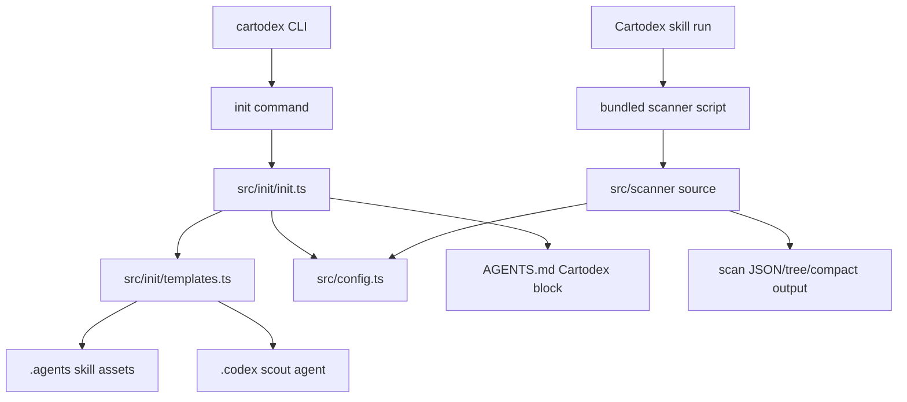

# Cartodex Map

> Auto-generated by Cartodex, a Codex port inspired by Cartographer. Last mapped: 2026-06-24T20:05:48Z

## System Overview

Cartodex is a TypeScript ESM CLI package that installs Codex-oriented repository mapping assets and ships a bundled scanner used by the Cartodex skill. The public CLI is intentionally thin: `src/cli.ts` configures Commander, `src/commands/init.ts` registers `cartodex init`, and durable behavior lives in `src/init/`, `src/config.ts`, and `src/scanner/`.

The current workspace includes update-mode changes that make the configured `mapPath` flow into both the managed `AGENTS.md` section and the installed Cartodex skill prompt. That means `cartodex init` now renders concrete map-path instructions into downstream `.agents/skills/cartodex/SKILL.md` files instead of leaving generic placeholders.



## Directory Structure

```text
.
|-- .agents/skills/cartodex/       Installed Cartodex skill, scanner script, and report/map resources.
|-- .agents/skills/prepare-release/ Release workflow skill for version bumps and publish readiness.
|-- .codex/agents/                 Local Codex agent definitions, including cartodex-scout.
|-- docs/                          Project philosophy and this generated map.
|-- src/
|   |-- cli.ts                     Executable Commander entry point.
|   |-- commands/                  CLI command registration.
|   |-- config.ts                  Shared cartodex.config.json loader and validator.
|   |-- init/                      Asset installation workflow and templates manifest.
|   |-- scanner/                   Repository scanner, ignore rules, and token counting.
|   `-- templates/                 Packaged files copied by cartodex init.
|-- tests/                         Vitest coverage for config, init, and scanner behavior.
|-- cartodex.config.json           Repo-local map path and Cartodex ignore config.
|-- package.json                   npm binary, scripts, engines, and dependencies.
`-- tsconfig.json                  Strict NodeNext TypeScript compilation.
```

## Module Guide

### CLI And Package Surface

**Purpose**: Exposes the `cartodex` executable and wires command-line requests into implementation modules.

**Entry point**: `src/cli.ts`

**Key files**:

| File | Purpose | Tokens |
| --- | --- | ---: |
| `src/cli.ts` | Creates the Commander program, sets CLI metadata, registers commands, and parses argv. | 78 |
| `src/commands/init.ts` | Defines `cartodex init`, maps `--force` and `--check` into `initCartodex`, prints messages, and sets exit codes. | 224 |
| `package.json` | Defines package version `0.2.0`, `bin.cartodex`, scripts, package files, Node `>=20`, runtime deps, and build/test tooling. | 465 |
| `tsconfig.json` | Uses strict NodeNext ESM compilation into `dist/`. | 124 |
| `README.md` | Public install, init, config, scanner, and mapping usage docs. | 913 |

**Exports**: `registerInitCommand(program: Command): Command`. The npm binary is `dist/cli.js`; no package `exports` field is defined.

**Dependencies**: `commander`; internal `src/init/init.ts`.

**Dependents**: npm binary execution and tests that exercise init behavior through the domain API.

### Configuration

**Purpose**: Centralizes `cartodex.config.json` loading and validation so init and scanning share one configuration contract.

**Entry point**: `loadCartodexConfig(root: string)`

**Key files**:

| File | Purpose | Tokens |
| --- | --- | ---: |
| `src/config.ts` | Loads defaults, parses config JSON, validates `ignore` and repo-relative Markdown `mapPath`. | 733 |
| `cartodex.config.json` | Current repo config: `mapPath` is `docs/CARTODEX_MAP.md`; `ignore` is empty. | skipped by scanner default path ignore |
| `tests/config.test.ts` | Covers defaults, custom config merge, omitted `mapPath`, ignored extra fields, and invalid map paths. | 458 |

**Exports**: `CARTODEX_CONFIG_FILE`, `DEFAULT_MAP_PATH`, `CartodexConfig`, `loadCartodexConfig`.

**Dependencies**: Node `fs` and `path` helpers.

**Dependents**: `src/init/init.ts` uses `mapPath` for AGENTS and skill prompt rendering; `src/scanner/ignore.ts` uses `ignore` patterns during scans.

### Init Workflow

**Purpose**: Implements `cartodex init`, installing managed Cartodex assets into a git repository and maintaining the Cartodex block in `AGENTS.md`.

**Entry point**: `initCartodex(options: InitOptions)`

**Key files**:

| File | Purpose | Tokens |
| --- | --- | ---: |
| `src/init/init.ts` | Orchestrates git-root discovery, config loading, template rendering, file status analysis, writes, blocking rules, and user messages. | 1622 |
| `src/init/repo.ts` | Finds the nearest parent git root by checking `.git` files or directories. | 202 |
| `src/init/templates.ts` | Reads packaged templates, injects managed markers, renders map-path placeholders, and defines install targets. | 1143 |
| `src/templates/AGENTS.cartodex.md` | Template for the managed AGENTS marker block. | 96 |
| `tests/init.test.ts` | Covers idempotency, default/custom map-path rendering, stale/conflict handling, force, and check mode. | 2551 |

**Exports**: `initCartodex`, `upsertAgentsSection`, `findGitRoot`, template constants, `INIT_TEMPLATES`, `renderInitTemplates`, `renderAgentsCartodexSection`, `renderCartodexSkillTemplate`.

**Dependencies**: `src/config.ts`, `src/init/templates.ts`, `src/init/repo.ts`, Node filesystem/path APIs.

**Dependents**: `src/commands/init.ts`; tests.

### Scanner

**Purpose**: Walks a repository, filters ignored and unsuitable files, estimates token counts, and emits JSON, tree, or compact output for Cartodex orchestration.

**Entry point**: `runCli(argv?)` for script use; `scanDirectory(rootPath, encoding, maxFileTokens?)` for programmatic use.

**Key files**:

| File | Purpose | Tokens |
| --- | --- | ---: |
| `src/scanner/scan-codebase.ts` | Core traversal, text detection, skip taxonomy, output formatters, and scanner CLI. | 3124 |
| `src/scanner/ignore.ts` | Default ignores, `.gitignore` parsing, Cartodex ignore merging, minimatch behavior. | 958 |
| `src/scanner/tokens.ts` | Loads `js-tiktoken` encodings and counts tokens with fallback estimation. | 94 |
| `tests/scanner/scan-codebase.test.ts` | Behavioral coverage for scan results, skips, ignores, output formats, and parser errors. | 1766 |
| `src/templates/skill/scripts/scan-codebase.mjs` | Generated bundled scanner installed into user repositories; skipped in scans because it is large. | skipped: too_large |

**Exports**: `isTextFile`, `scanDirectory`, `formatTree`, `parseArgs`, `runCli`, `loadEncoding`, `countTokens`, `parseGitignore`, `loadIgnorePatterns`, `matchesGitignorePattern`, `shouldIgnore`.

**Dependencies**: `js-tiktoken`, `minimatch`, `src/config.ts`, Node filesystem/path/url APIs.

**Dependents**: Bundled scanner script, Cartodex skill workflow, scanner tests.

### Templates And Installed Cartodex Assets

**Purpose**: Provides the files copied by `cartodex init` into target repositories.

**Entry point**: `renderInitTemplates(mapPath)` and `INIT_TEMPLATES` in `src/init/templates.ts`

**Key files**:

| File | Purpose | Tokens |
| --- | --- | ---: |
| `src/templates/skill/SKILL.md` | Packaged Cartodex skill workflow template with `{{mapPath}}` placeholders. | 1367 |
| `src/templates/skill/resources/cartodex-map-structure.md` | Canonical generated map structure, including `total_files` and `total_tokens`. | 323 |
| `src/templates/skill/resources/subagent-report-format.md` | Required subagent report format. | 266 |
| `src/templates/codex/cartodex-scout.toml` | Read-only scout agent template. | 374 |
| `.agents/skills/cartodex/SKILL.md` | Installed local copy of the Cartodex skill used in this repo. | 1411 |
| `.codex/agents/cartodex-scout.toml` | Installed local scout agent definition. | 396 |

**Exports**: Template constants plus rendered managed AGENTS and Cartodex skill helpers.

**Dependencies**: Template files are read from `src/templates` at runtime in source form and bundled/compiled for distribution.

**Dependents**: `src/init/init.ts`, downstream repositories initialized by Cartodex.

### Local Skills, Guidance, And Attribution

**Purpose**: Documents repository-specific agent guidance, release workflow, project philosophy, and upstream attribution.

**Entry point**: `AGENTS.md`

**Key files**:

| File | Purpose | Tokens |
| --- | --- | ---: |
| `AGENTS.md` | Contributor and agent instructions, including the Cartodex map pointer. | 676 |
| `docs/PROJECT_PHILOSOPHY.md` | Explains when maps should be updated and how they support orientation. | 426 |
| `.agents/skills/prepare-release/SKILL.md` | Release preparation workflow for versioning, validation, branches, tags, and publish readiness. | 1044 |
| `.agents/skills/prepare-release/agents/openai.yaml` | Release skill metadata and default prompt. | 59 |
| `LICENSE` | MIT license with Cartodex and upstream Bootoshi notices. | 233 |
| `NOTICE.md` | Attribution to the original Cartographer project. | 69 |

**Exports**: Human/agent operating contracts rather than TypeScript APIs.

**Dependencies**: Release skill depends on git and npm commands; repository guidance references this map.

**Dependents**: Codex agents and maintainers working in the repository.

## Data Flow

### `cartodex init`

1. `src/cli.ts` starts Commander and registers `init`.
2. `src/commands/init.ts` collects `process.cwd()`, `--force`, and `--check`.
3. `initCartodex` locates the git root with `findGitRoot`.
4. `loadCartodexConfig` resolves the repo `mapPath` and scanner ignore config once for the run.
5. `renderInitTemplates(config.mapPath)` injects the concrete map path into the installed skill prompt; `upsertAgentsSection` injects it into `AGENTS.md`.
6. Each target is classified as `missing`, `current`, `stale`, or `conflict`.
7. Non-check runs write missing files and write stale managed files only with `--force`.
8. Result messages summarize statuses and exit code.

Status matrix:

| Status | Meaning | Normal init | `--force` | `--check` |
| --- | --- | --- | --- | --- |
| `missing` | Target absent or AGENTS block missing. | create | create | report non-current |
| `current` | File matches desired content. | unchanged | unchanged | report current |
| `stale` | Managed file/block differs. | blocked | update | report non-current |
| `conflict` | Existing unmanaged content would be overwritten. | blocked | blocked | report non-current |

### Scanner Execution

1. `runCli` parses scanner args: path defaults to `.`, format defaults to `json`, max tokens defaults to `50000`, encoding defaults to `cl100k_base`.
2. It validates path existence, directory status, and tokenizer loading.
3. `scanDirectory` loads ignore patterns from `.gitignore` plus `cartodex.config.json.ignore`.
4. Directory traversal is sorted with directories before files.
5. Files are skipped for default/user ignores, read/stat errors, size over 1 MB, binary detection, or token count over the max threshold.
6. Text files are counted with `js-tiktoken`; if encoding fails, `countTokens` falls back to `Math.floor(text.length / 4)`.
7. Output is JSON `ScanResult`, tree view, or compact token-sorted listing.

`ScanResult` contains `root`, `files`, `directories`, `total_tokens`, `total_files`, and `skipped`. Skipped reasons include `permission_denied`, `too_large`, `binary`, `too_many_tokens`, and `read_error: ...`.

The generated scanner can be excluded in two ways during mapping: `.agents/skills/cartodex/scripts/scan-codebase.mjs` is path-ignored by default, while `src/templates/skill/scripts/scan-codebase.mjs` is skipped as `too_large` because the bundle is over the 1 MB file-size threshold.

### Build, Packaging, And Release

1. `npm run build:scanner` bundles `src/scanner/scan-codebase.ts` with esbuild into `src/templates/skill/scripts/scan-codebase.mjs`.
2. `npm run build` runs that scanner bundle step and then compiles TypeScript with `tsc`.
3. `prepack` runs the full build.
4. `prepublishOnly` runs tests.
5. Package `files` include `dist`, `src/templates`, and `NOTICE.md`.
6. The local `prepare-release` skill expects a `chore/release-vX.Y.Z` branch, version updates in package metadata and lockfiles, validation with tests/build/package dry-run, push/merge/tag handling, and no actual publish unless the user explicitly asks.

## Conventions

- TypeScript uses strict NodeNext ESM and explicit `.js` extensions in relative imports.
- Source style is two-space indentation, double quotes, semicolons, and small named functions.
- Runtime behavior is kept out of CLI modules where possible; command files adapt user input to domain APIs.
- Config loading is fail-fast and message-oriented. Unknown config fields are ignored, but `ignore` must be an array of strings and `mapPath` must be a repo-relative `.md` path without traversal.
- Cartodex-managed files use the `cartodex-managed` marker. The AGENTS block uses `<!-- CARTODEX:START -->` and `<!-- CARTODEX:END -->`.
- Template rendering uses `{{mapPath}}` placeholders for installed skill and AGENTS assets; default rendering falls back to `docs/CARTODEX_MAP.md`.
- Scanner ignore precedence starts with hardcoded default ignores and default path ignores, then applies `.gitignore` plus Cartodex config patterns in order. Negated patterns only affect the user-pattern stage.
- Scanner tests use temporary directories and deterministic fake encodings where exact token counts matter.
- Map maintenance should happen when architecture, contracts, workflows, or generated asset boundaries change. Small isolated bug fixes usually do not require a map update.

## Gotchas

- `cartodex init` requires a git repository root.
- `--force` resets stale managed files but still never overwrites unmanaged conflicts.
- A malformed `cartodex.config.json` can block both init and scanner workflows because both load shared config.
- Map-path changes can make both `AGENTS.md` and the installed `.agents/skills/cartodex/SKILL.md` stale.
- The bundled scanner script is generated and large; update it with `npm run build:scanner`, not by hand.
- The scanner deliberately ignores `.agents/skills/cartodex/scripts/scan-codebase.mjs` and `cartodex.config.json` by default path.
- File text detection is allowlist first, then UTF-8/null-byte sniffing; it is not MIME-based.
- Tests assert some user-facing error message fragments, so wording changes can require test updates.
- Changes under `.agents`, `.codex`, or `src/templates` affect assets installed into downstream repositories.
- The project carries MIT licensing and attribution to the original Cartographer project; preserve `LICENSE` and `NOTICE.md` expectations in releases and generated documentation.

## Navigation Guide

**To add or change a CLI command**: Start at `src/cli.ts` and `src/commands/`. Keep command modules thin and push behavior into a feature module with tests.

**To change init behavior**: Inspect `src/init/init.ts`, `src/init/templates.ts`, `src/init/repo.ts`, `src/templates/*`, and `tests/init.test.ts`. Check stale/conflict semantics before changing write behavior.

**To change map-path handling**: Inspect `src/config.ts`, `src/init/init.ts`, `src/init/templates.ts`, `src/templates/AGENTS.cartodex.md`, `src/templates/skill/SKILL.md`, `tests/config.test.ts`, and `tests/init.test.ts`.

**To change installed Cartodex assets**: Edit `src/templates/...`, update tests that compare installed content, then run `npm run build` if scanner or packaged templates are affected.

**To change scanner traversal or output**: Inspect `src/scanner/scan-codebase.ts`, `src/scanner/ignore.ts`, `src/scanner/tokens.ts`, and `tests/scanner/scan-codebase.test.ts`. Rebuild the bundled scanner with `npm run build:scanner`.

**To change config behavior**: Start with `src/config.ts`, then check `src/init/init.ts`, `src/scanner/ignore.ts`, `tests/config.test.ts`, and scanner tests for integration expectations.

**To prepare a release**: Use `.agents/skills/prepare-release/SKILL.md`; expect npm validation through tests, build, and package dry-run, with careful branch/tag handling.

**To update this map**: Run the Cartodex skill again. It should scan the repo, use focused scout agents, write `docs/CARTODEX_MAP.md`, and refresh the AGENTS marker block if the configured path changes.
