# Cartodex Map

> Auto-generated by Cartodex, a Codex port inspired by Cartographer. Last mapped: 2026-08-23T10:17:06Z

## System Overview

Cartodex is an npm-workspaces TypeScript monorepo with two aligned publishable packages. `cartodex` is the user-facing CLI: its `init` command installs repository-local mapping instructions, resources, a scanner launcher, and a read-only scout definition. `@cartodex/runtime` is the scanner implementation: it exposes traversal, ignore handling, token estimation, output formatting, and the scanner CLI API consumed by the launcher.

The launcher keeps installed assets small by creating an isolated tools environment on first use or when its shipped lockfile changes, installing the exact runtime dependency, dynamically importing it, and forwarding scanner arguments to `runCli`. Releases therefore have a runtime-first boundary: publish `@cartodex/runtime`, regenerate the nested launcher lockfile from that registry version, validate both tarballs, then publish `cartodex` at the same version.

```mermaid
flowchart LR
  U["npx cartodex init"] --> CLI["cartodex CLI"]
  CLI --> INIT["init/config/template pipeline"]
  INIT --> ASSETS[".agents skill + .codex scout + AGENTS block"]
  ASSETS --> SKILL["Cartodex mapping run"]
  SKILL --> LAUNCHER["installed scanner launcher"]
  LAUNCHER --> TOOLS["isolated npm tools directory"]
  TOOLS --> RUNTIME["@cartodex/runtime"]
  RUNTIME --> RESULT["JSON/tree/compact scan result"]
  RESULT --> MAP["docs/CARTODEX_MAP.md"]
```



## Directory Structure

```text
.
|-- packages/
|   |-- cartodex/                    Publishable CLI and repository-asset templates.
|   |   |-- src/cli.ts               Commander executable entry point.
|   |   |-- src/commands/            Thin CLI command adapters.
|   |   |-- src/init/                Git-root discovery and managed-file installation.
|   |   |-- src/templates/           Assets shipped into initialized repositories.
|   |   `-- tests/                   Config and init behavior tests.
|   `-- runtime/                     Publishable deterministic scanner runtime.
|       |-- src/index.ts             Package export surface.
|       |-- src/config.ts            Runtime copy of config loading and validation.
|       |-- src/scanner/             Traversal, ignores, token counts, and output.
|       `-- tests/                   Scanner behavior tests.
|-- .agents/skills/cartodex/         Installed Cartodex skill used in this repository.
|-- .agents/skills/prepare-release/  Runtime-first release coordination skill.
|-- .codex/agents/                    Installed read-only Cartodex scout definition.
|-- docs/                             Generated map, philosophy, and roadmap.
|-- AGENTS.md                         Contributor rules and generated map pointer.
|-- cartodex.config.json              Repo-local map, ignore, and scout settings.
|-- package.json                      Private npm-workspaces command router.
`-- package-lock.json                 Monorepo development lockfile; not published.
```

## Module Guide

### Workspace And Release Coordination

**Purpose**: Routes build, test, typecheck, and package-preview commands across both workspaces and records the lockstep release contract.

**Entry point**: `package.json`

**Key files**:

| File | Purpose | Tokens |
| --- | --- | ---: |
| `package.json` | Declares the private `packages/*` workspace, Node `>=20`, npm version, and root command fan-out. | 156 |
| `AGENTS.md` | Defines repository layout, coding/testing rules, generated-asset boundaries, and runtime-first release coordination. | 938 |
| `.agents/skills/prepare-release/SKILL.md` | Coordinates aligned versions, runtime publication, nested lockfile regeneration, tarball validation, merge, and tags. | 1223 |
| `README.md` | Documents installation, init states, scanner bootstrap, configuration, development, and release architecture. | 1476 |
| `.npmrc` | Requires exact dependency versions when npm writes manifests. | 5 |

**Exports**: Workspace scripts `build`, `test`, `typecheck`, `pack:cartodex`, and `pack:runtime`; human/agent release procedures.

**Dependencies**: npm workspaces, Node.js `>=20`, both package manifests, and the root development lockfile.

**Dependents**: Local development, validation, package preview, and the `prepare-release` workflow.

### Cartodex CLI And Configuration

**Purpose**: Exposes `cartodex init`, adapts CLI flags to the init domain API, and loads repository configuration used when rendering installed assets.

**Entry point**: `packages/cartodex/src/cli.ts`

**Key files**:

| File | Purpose | Tokens |
| --- | --- | ---: |
| `packages/cartodex/src/cli.ts` | Creates the Commander program, registers commands, and parses process arguments. | 78 |
| `packages/cartodex/src/commands/init.ts` | Registers `init`, `--force`, and `--check`; prints results and sets the process exit code. | 224 |
| `packages/cartodex/src/config.ts` | Loads defaults and validates `ignore`, repository-relative Markdown `mapPath`, and scout settings. | 1074 |
| `packages/cartodex/package.json` | Declares package `cartodex` version `0.3.2`, its binary, shipped files, scripts, and Commander. | 433 |
| `packages/cartodex/tests/config.test.ts` | Specifies configuration defaults, merges, unknown fields, and validation failures. | 856 |

**Exports**: The package exposes the `cartodex` executable rather than a package-root library API. Important internal APIs include `registerInitCommand`, `loadCartodexConfig`, config constants, and config types.

**Dependencies**: `commander`, Node filesystem/path APIs, and the init module.

**Dependents**: CLI users and the init test suite.

### Init And Managed Asset Installation

**Purpose**: Finds the containing git repository, renders configured templates, classifies existing targets, and safely creates or refreshes Cartodex-managed files.

**Entry point**: `initCartodex(options)` in `packages/cartodex/src/init/init.ts`

**Key files**:

| File | Purpose | Tokens |
| --- | --- | ---: |
| `packages/cartodex/src/init/init.ts` | Orchestrates repository discovery, rendering, state classification, writes/removals, messages, and result codes. | 1838 |
| `packages/cartodex/src/init/templates.ts` | Defines install targets, managed markers, retired paths, placeholders, and render helpers. | 1923 |
| `packages/cartodex/src/init/repo.ts` | Walks upward to find a `.git` file or directory. | 202 |
| `packages/cartodex/src/templates/AGENTS.cartodex.md` | Supplies the managed AGENTS block pointing to the configured map path. | 96 |
| `packages/cartodex/tests/init.test.ts` | Covers idempotency, states, force/check modes, rendering, cleanup, and filesystem edge cases. | 4437 |

**Exports**: `initCartodex`, init option/result/status types, `upsertAgentsSection`, `findGitRoot`, `INIT_TEMPLATES`, template constants, and render helpers.

**Dependencies**: CLI config, template source files, and Node filesystem/path APIs.

**Dependents**: The `init` command and downstream repositories initialized by Cartodex.

| State | Meaning | Normal init | `--force` | `--check` |
| --- | --- | --- | --- | --- |
| `missing` | Target or managed AGENTS block is absent. | create | create | report non-current |
| `current` | Existing managed content matches rendered content. | unchanged | unchanged | report current |
| `stale` | Managed content differs from the rendered version. | block | update | report non-current |
| `conflict` | Existing unmanaged content would be overwritten. | block | block | report non-current |

### Installed Skill And Scanner Bootstrap

**Purpose**: Ships the mapping workflow, report/map schemas, read-only scout configuration, and a small launcher that installs and invokes the scanner runtime.

**Entry point**: `packages/cartodex/src/templates/skill/SKILL.md`

**Key files**:

| File | Purpose | Tokens |
| --- | --- | ---: |
| `packages/cartodex/src/templates/skill/SKILL.md` | Defines mapping modes, scanning, delegation, token reconciliation, map writing, and AGENTS refresh. | 1592 |
| `packages/cartodex/src/templates/skill/resources/cartodex-map-structure.md` | Defines stable frontmatter and the canonical map structure. | 392 |
| `packages/cartodex/src/templates/skill/resources/configuration-guide.md` | Explains `mapPath`, ignores, scout settings, and refresh behavior. | 1365 |
| `packages/cartodex/src/templates/skill/resources/subagent-report-format.md` | Defines the factual report shape expected from scouts. | 332 |
| `packages/cartodex/src/templates/codex/cartodex-scout.toml` | Defines a read-only scout with configurable model and reasoning effort. | 373 |
| `packages/cartodex/src/templates/skill/scripts/scan-codebase.mjs` | Hash-checks dependencies, runs `npm ci` when needed, imports the runtime, and calls `runCli`. | 571 |
| `packages/cartodex/src/templates/skill/scripts/tools/package.json` | Pins the matching runtime dependency for installed scanner execution. | 78 |
| `packages/cartodex/src/templates/skill/scripts/tools/gitignore` | Keeps tool-managed dependencies and install state out of downstream repositories. | 40 |

**Exports**: Installed workflow assets rather than TypeScript APIs. The launcher delegates its contract to `@cartodex/runtime.runCli`.

**Dependencies**: Init substitutions, npm, the shipped tools manifest/lockfile, and the registry release of the exactly pinned runtime.

**Dependents**: Initialized repositories, mapping sessions, and the runtime-first release process.

### Runtime Package And Scanner

**Purpose**: Provides deterministic traversal, ignore rules, text detection, token estimation, directory summaries, skip reasons, and JSON/tree/compact output.

**Entry point**: `packages/runtime/src/index.ts`; `runCli(argv?)` for the installed launcher.

**Key files**:

| File | Purpose | Tokens |
| --- | --- | ---: |
| `packages/runtime/src/index.ts` | Re-exports scanner, ignore, token, result, and encoding APIs. | 108 |
| `packages/runtime/src/scanner/scan-codebase.ts` | Implements traversal, eligibility, scan contracts, summaries, formatting, arguments, and CLI execution. | 3371 |
| `packages/runtime/src/scanner/ignore.ts` | Merges default paths, `.gitignore`, and Cartodex patterns with ordered negation. | 969 |
| `packages/runtime/src/scanner/tokens.ts` | Wraps `js-tiktoken` encoding and fallback estimation. | 94 |
| `packages/runtime/src/config.ts` | Loads and validates the config contract needed by ignore handling. | 1070 |
| `packages/runtime/tests/scan-codebase.test.ts` | Covers traversal, skips, ignores, config errors, summaries, formats, and argument errors. | 2169 |
| `packages/runtime/package.json` | Declares runtime version `0.3.2`, ESM exports, lifecycle scripts, and dependencies. | 475 |

**Exports**: `scanDirectory`, `runCli`, `parseArgs`, `formatTree`, `isTextFile`, scan result/types, ignore helpers/constants, and token helpers/types.

**Dependencies**: `js-tiktoken`, `minimatch`, Node APIs, and the runtime-local config loader.

**Dependents**: The generated launcher, runtime tests, and programmatic runtime consumers.

### Repository-Local Agent Assets And Guidance

**Purpose**: Applies Cartodex’s installed workflow to this repository and records when maps should be refreshed.

**Entry point**: `AGENTS.md`

**Key files**:

| File | Purpose | Tokens |
| --- | --- | ---: |
| `.agents/skills/cartodex/SKILL.md` | Installed mapping workflow used to generate this map. | 1636 |
| `.agents/skills/cartodex/resources/cartodex-map-structure.md` | Installed canonical map schema. | 415 |
| `.agents/skills/cartodex/resources/configuration-guide.md` | Installed configuration guidance. | 1388 |
| `.agents/skills/cartodex/resources/subagent-report-format.md` | Installed scout report schema. | 355 |
| `.codex/agents/cartodex-scout.toml` | Configures the repository’s read-only mapping scout. | 396 |
| `.codex/config.toml` | Holds repository-local Codex tool configuration. | 126 |
| `docs/PROJECT_PHILOSOPHY.md` | Explains map value, freshness criteria, and useful update boundaries. | 426 |
| `docs/ROADMAP.md` | Tracks freshness, conventions, scenario capture, and stale-state improvements. | 510 |

**Exports**: Human and agent operating contracts.

**Dependencies**: Installed template assets and `cartodex.config.json`; the config is intentionally absent from scanner file rows because scanner policy ignores it.

**Dependents**: Codex agents and contributors navigating or maintaining this repository.

## Data Flow

### Initialization

1. `packages/cartodex/src/cli.ts` creates the Commander program and registers `init`.
2. The command adapter sends `cwd`, `--force`, and `--check` to `initCartodex`.
3. Init locates the git root and loads `cartodex.config.json` once.
4. Rendering substitutes `mapPath`, scout model, and reasoning effort into managed assets.
5. Targets are classified as missing, current, stale, or conflicting; `AGENTS.md` is a marker-delimited block so unrelated content survives.
6. Normal init creates missing assets; `--force` also refreshes stale managed assets and retired managed paths; neither overwrites unmanaged conflicts.

### Mapping And Scanner Execution

1. The installed skill detects full or update mode from map frontmatter and launches the scanner.
2. The launcher hashes its nested lockfile; a missing or changed install stamp triggers `npm ci` in the isolated tools directory.
3. It imports `@cartodex/runtime` and forwards arguments to `runCli`.
4. `runCli` validates path, format, token limit, and encoding, then calls `scanDirectory`.
5. The scanner loads default ignores, `.gitignore`, and config patterns; walks deterministically; rejects oversized, binary, unreadable, or over-budget files; and counts accepted text.
6. It returns `files`, `directories`, `directory_summaries`, totals, and `skipped`, rendered as JSON, tree, or compact output.
7. Scouts analyze bounded modules; the orchestrator synthesizes reports and reconciles map token cells to scanner output.

### Build, Packaging, And Release

1. Root scripts fan out build, test, and typecheck to both workspaces; each compiles `src` into package-local `dist`.
2. Dry-run pack commands preview both tarballs.
3. Release preparation aligns package versions and pins the nested tools manifest to the exact runtime version.
4. The runtime is published first; the nested tools lockfile is regenerated from that registry release rather than hand-edited.
5. Both tarballs and runtime bootstrap are validated before the CLI is published and the aligned version tagged.

## Conventions

- TypeScript is strict NodeNext ESM; relative imports include explicit `.js` extensions.
- Source uses two-space indentation, double quotes, semicolons, and small named functions.
- CLI command modules stay thin; durable behavior belongs in init/config modules or the runtime.
- Tests use Vitest and temporary repositories/directories to specify public behavior and filesystem edges.
- Managed files carry a `cartodex-managed` marker; the AGENTS section uses `CARTODEX:START`/`END` comments.
- Templates under `packages/cartodex/src/templates/` are canonical. Installed `.agents`/`.codex` copies are refreshed through init, not edited as normal source.
- Scanner traversal is deterministic: directories precede files and names are lexicographically sorted.
- Ignore policy starts with built-ins, then evaluates `.gitignore` and config patterns in order; later user negations can restore paths.
- Published package versions stay aligned, the nested runtime dependency is exact, and generated map token cells come only from scanner records.

## Gotchas

- `cartodex init` requires a containing git repository.
- `--force` refreshes stale managed content but does not overwrite unmanaged conflicts or malformed AGENTS marker regions.
- Config changes deliberately make affected installed assets stale; run init with `--force` to propagate them.
- CLI and runtime maintain parallel config loaders; contract changes must be applied and tested in both.
- The scanner may need registry access on first run or after its nested lockfile changes because it executes `npm ci` in its tools directory.
- Installed launcher/tools paths are ignored to prevent self-scanning; the source template launcher remains visible.
- Directory summaries include accepted files only; text detection is allowlist plus UTF-8/null-byte sniffing, not MIME detection.
- The root lockfile is not shipped. The nested tools lockfile is a separate published asset regenerated after the runtime reaches the registry.
- README examples may describe defaults while this repository’s config intentionally overrides local scout settings.
- Preserve MIT licensing and attribution to the original Cartographer project.

## Navigation Guide

**To add or change a CLI command**: Start at `packages/cartodex/src/cli.ts` and `src/commands/`; keep adapters thin and add package tests.

**To change init behavior**: Inspect `packages/cartodex/src/init/` and `packages/cartodex/tests/init.test.ts`. Preserve unmanaged-conflict and AGENTS-block guarantees.

**To change config behavior**: Update both package-local `src/config.ts` copies, then check CLI config/init tests and runtime scanner tests.

**To change installed assets**: Edit `packages/cartodex/src/templates/`, update installer expectations, build, then refresh installed copies separately with `cartodex init --force`.

**To change scanner behavior**: Start at `packages/runtime/src/scanner/`, update runtime tests, and check `packages/runtime/src/index.ts` exports.

**To change scanner bootstrapping**: Inspect the template launcher and nested tools manifest/lockfile, then validate a clean first run and lockfile-change reinstall.

**To change mapping orchestration**: Edit source skill/resources under `packages/cartodex/src/templates/skill/`; refresh installed `.agents` assets separately.

**To prepare a release**: Use `.agents/skills/prepare-release/SKILL.md`; publish runtime first, regenerate the nested lockfile, and validate both tarballs.

**To update this map**: Run the Cartodex skill to scan, delegate bounded analysis, reconcile tokens, write this file, and refresh the AGENTS pointer when needed.
